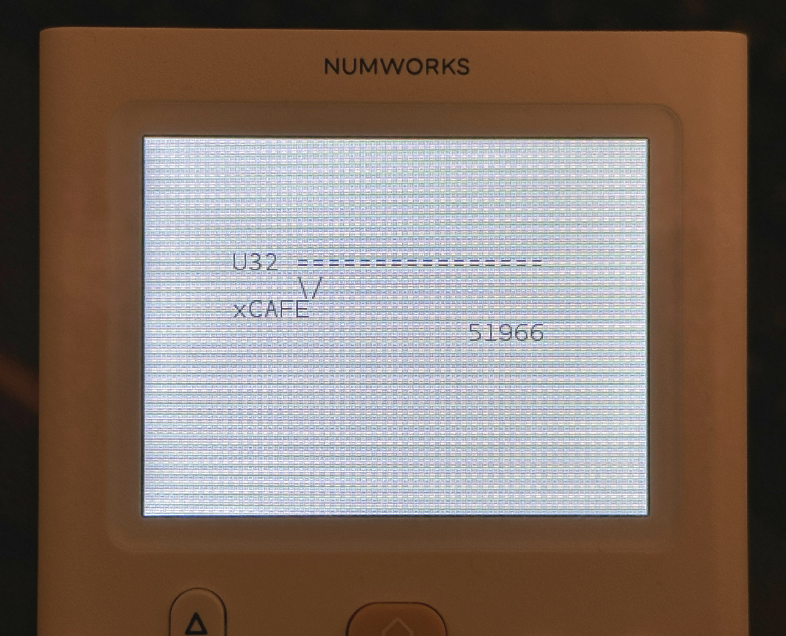

# Delta Radix for NumWorks

This is a HAL and binary target to run the 
**[Delta Radix](https://github.com/AaronC81/delta-radix) calculator software** as an EADK app on a
physical NumWorks graphing calculator. (Tested on a NumWorks N0120, running Epsilon 21.3.0.)



Based on my [Rust app template](https://github.com/AaronC81/numworks-epsilon-rust-template.git).

## Usage

First, install the same dependencies as the
[Epsilon C example app](https://github.com/numworks/epsilon-sample-app-c):

- The `arm-none-eabi-gcc` toolchain
- Node.js **18**
  - 14 and 21 both didn't work for me, due to breaking API changes!
- [nwlink](https://www.npmjs.com/package/nwlink) 0.0.17

Once installed, you can build an NWA and run it on your calculator:

```shell
make build  # Build into NWA
make check  # Ensure that NWA links successfully
make run    # Upload to calculator
```
